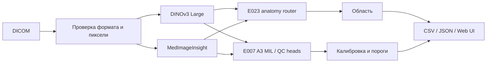

# DXA QC

## О проекте

DXA QC — локальный прототип автоматического контроля качества DICOM-исследований поясничного отдела позвоночника и проксимального отдела бедра. Результат предназначен для проверки специалистом; независимая клиническая точность на DXA-снимках с экспертными поизображенческими метками не установлена.

## Возможности

- Принимает один DICOM или пакет, определяет область по пикселям и группирует снимки по StudyInstanceUID.
- Оценивает независимое качество и несколько применимых нарушений; выдаёт восемь полей CSV и подробный JSON.
- Предоставляет CLI, batch и web UI с просмотром снимков и результатов.

## Архитектура



Оценка E007 агрегирует признаки снимков внутри исследования и повторяется в строках его снимков. Это ограничивает смысл поизображенческого вывода.

## Какие нарушения поддерживаются

Позвоночник: некорректная укладка, невыравненная ось, посторонние предметы. Бедро: некорректная укладка с ротацией и некорректная область интереса. Достоверная сторона бедра не определяется.

## Установка

Python-зависимости закреплены в [requirements-inference.txt](requirements-inference.txt). Веса DINOv3, MedImageInsight, E007 A3 и E023 хранятся локально по путям из [инвентаря активов](docs/MODEL_ASSETS.md), вне Git. Право на распространение сторонних весов описано там же.

## Docker build

`docker build -t dxa-qc:stopcode-20260929 .` Собранный образ запускает inference без сети при наличии локальных весов.

## Docker run

```bash
export DXA_ASSETS_DIR=/absolute/path/to/private-assets
docker compose -f deploy/docker-compose.yml up --build -d
curl http://127.0.0.1:8000/api/health
```

Compose открывает сервис только на loopback; публичный доступ даёт Nginx. Без NVIDIA GPU задайте `DXA_QC_DEVICE=cpu`; скорость CPU на целевом сервере нужно измерить.

## Batch API

`python scripts/run_dxa_qc_service.py /path/to/dicom-batch --device auto --json result.json --csv result.csv`. Однозначные StudyInstanceUID разделяются автоматически. Карта `--study-groups` нужна для проверенных случаев с переписанными UID или неоднозначными границами. Нечитаемые файлы видны в JSON; CSV-политика `Failure` ещё не подтверждена организаторами.

## Web UI

Локально: `python scripts/run_dxa_qc_web.py` и `http://127.0.0.1:8000/`. Доступны загрузка, просмотр, фильтры, прогресс, CSV и JSON. Подробнее: [README_WEB.md](README_WEB.md) и [руководство](docs/USER_GUIDE.md).

## Формат CSV

`path_to_study,study_uid,image_uid,anatomical_region,quality_class,violation_type,processing_status,time_of_processing`. Одна строка соответствует снимку и области. Несколько нарушений разделены `;`. `quality_class` — отдельная learned target, а не OR нарушений. Вероятности, пороги, provenance и ошибки содержатся в JSON.

## Системные требования

Linux x86-64, Docker Engine/Compose и RAM для двух больших энкодеров. Точный минимум RAM финального образа не измерен. Для ускорения рекомендованы NVIDIA GPU, CUDA 12.6 и NVIDIA Container Toolkit. CPU fallback использует ту же модель.

## Результаты

Исторический E007 A3: средний пяти-классовый source-study proxy macro-F1 **0.24697** на групповых фолдах, семена 17/29/43. Это не официальная image-level метрика. E024 router на внешних рентгенограммах: balanced accuracy **0.899**, 42/208 бедренных изображений ошибочно направлены в позвоночник; это не DXA QC метрика. [Подробности](docs/EXPERIMENTS_SUMMARY.md).

## Производительность

Бенчмарк финальной сборки пока не выполнен. Старые измерения относятся к иному образу и не доказывают лимит 3 минуты на целевом сервере.

## Ограничения

Официальные метки относятся к исследованиям; экспертных поизображенческих DXA-меток нет. Сторона бедра не подтверждена. Router чувствителен к смене домена и композиции. Геометрические измерения без калибровки не выдаются. Поддержан single-frame 2-D uint8 MONOCHROME2 DICOM; другие форматы дают структурированную ошибку. [Подробнее](docs/LIMITATIONS.md).

## Безопасность данных

Исходные медицинские данные, закрытые карты и веса не публикуются в Git. Публичный стенд предназначен только для обезличенных файлов; загрузки хранятся временно на сервере, без сторонних inference API.

## Структура проекта

`src/dxa_qc/` — inference и web; `scripts/` — запуск и проверки; `tests/` — тесты; `deploy/` — Compose и инструкция; `docs/` — методика и ограничения; `artifacts/` и `models/` — локальные активы.

## Воспроизводимость

Сохранены групповые фолды, семена 17/29/43, калибровка, пороги, хеши и отчёты. Внешние проверочные данные и `Dataset_test` не использовались для настройки текущих порогов. [Технический отчёт](docs/FINAL_TECHNICAL_REPORT.md).

## Команда

**WWTEAM** · Telegram: [@phnid](https://t.me/phnid) · Email: nikkruglov16@gmail.com.
